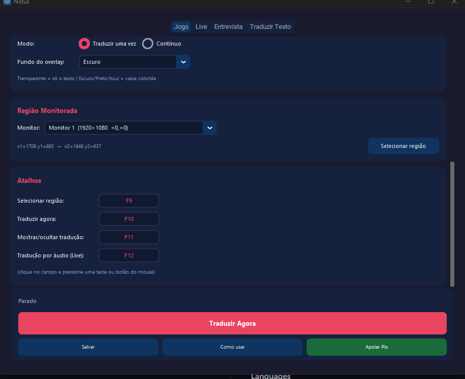
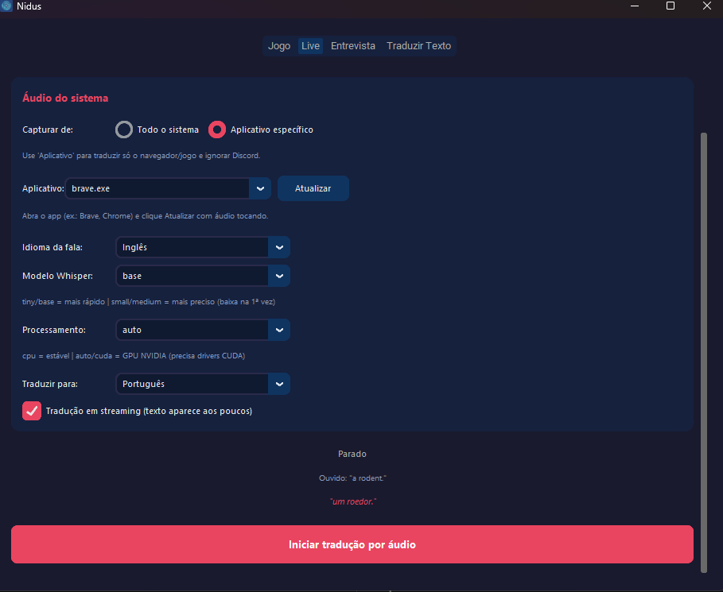
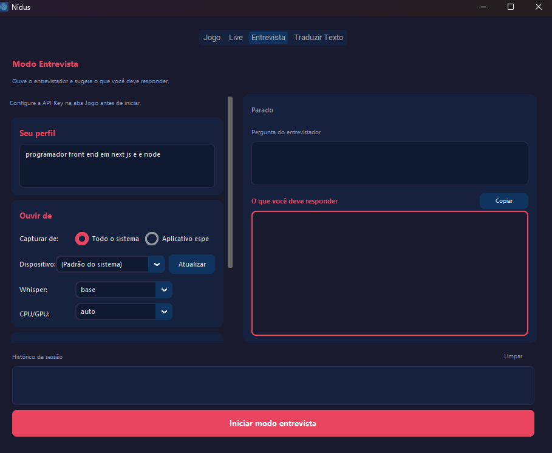
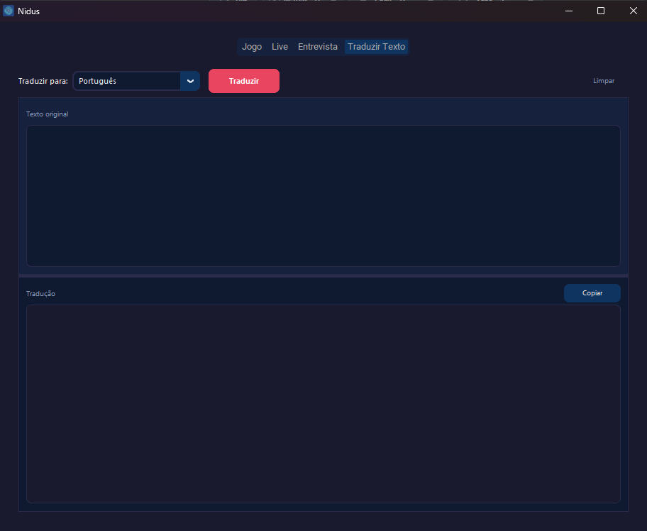

# Nidus

Nidus é um aplicativo de tradução para **PC (Windows)** que exibe um overlay flutuante sobre jogos e outros programas, capturando o texto da tela e traduzindo em tempo real com o provedor de IA da sua escolha.

 

---

## Capturas de tela

### Aba Jogo — tradução por tela

Configuração da API, região monitorada, atalhos, estilo do overlay e botões de ação:



### Aba Live — tradução por áudio

Captura de áudio do sistema ou de um app, Whisper e tradução em tempo real:



### Aba Entrevista — assistente para entrevistas

Ouve o entrevistador e sugere respostas com base no seu perfil:



### Aba Traduzir Texto

Tradutor manual para colar e traduzir qualquer texto:



---

## ⚠️ Este aplicativo é 100% gratuito

Este aplicativo é totalmente gratuito. Nada aqui é pago e nunca será. Se alguém te vendeu o Nidus, você está sendo enganado — baixe sempre a partir do [repositório oficial](https://github.com/Ettym200/nidus-pc).

Se quiser, você pode apoiar o projeto voluntariamente (via Pix, dentro do app), mas isso é opcional.

---

## Download (Windows)

**Forma mais fácil:** baixe o executável pronto na página de releases:

**[Baixar Nidus para Windows (última versão)](https://github.com/Ettym200/nidus-pc/releases/latest)**

1. Baixe o arquivo `Nidus.exe`
2. Execute e conceda permissão de administrador quando o Windows pedir
3. Configure sua API Key e comece a usar

> Baixe sempre pelo link acima. Versão atual: [v1.0.6](https://github.com/Ettym200/nidus-pc/releases/tag/v1.0.6)

---

## Download (Android / APK)

Quer usar o Nidus no celular? A versão para Android (Flutter) está em outro repositório:

**[Repositório do Nidus para Android](https://github.com/Ettym200/Nidus)**

**[Baixar APK (última versão)](https://github.com/Ettym200/Nidus/releases/latest)**

---

## Como usar

### 1. Instale

**Windows (executável — recomendado)**

Use o link de download acima. Não precisa instalar Python.

**Windows (código-fonte / desenvolvedores)**

1. Instale o [Python 3.8+](https://www.python.org/downloads/) — marque **"Add Python to PATH"**
2. Clone ou baixe este repositório
3. Execute `scripts\instalar.bat` — instala todas as dependências automaticamente
4. Execute `scripts\iniciar.bat` para abrir o app

> O app pede permissão de administrador automaticamente — necessário para os atalhos funcionarem dentro do jogo.

**Linux** (suporte experimental)

```bash
git clone https://github.com/Ettym200/nidus-pc
cd nidus-pc
pip install -r requirements.txt
bash scripts/iniciar.sh
```

> No Wayland, captura de tela e atalhos globais podem ter limitações. Se não funcionar, tente com `sudo`.

### 2. Configure a API

Escolha um provedor e obtenha sua API Key:

| Provedor | Plano grátis | Link |
|---|---|---|
| OpenRouter | Sim | [openrouter.ai](https://openrouter.ai) |
| Groq | Sim | [console.groq.com](https://console.groq.com) |
| OpenAI | Pago | [platform.openai.com](https://platform.openai.com) |
| Anthropic | Pago | [console.anthropic.com](https://console.anthropic.com) |

Cole a chave no campo **API Key** do app. Você pode salvar várias keys em **Gerenciar Keys**.

### 3. Selecione a região

- Abra o jogo e deixe o texto/legenda aparecer na tela
- Clique em **Selecionar região** ou use o atalho configurado (padrão: `F9`)
- Arraste para delimitar a área onde ficam as legendas

### 4. Traduza

**Modo "Traduzir uma vez"** — pressione o atalho ou clique no botão. Ideal para itens, missões e textos pontuais.

**Modo "Contínuo"** — monitora a região automaticamente e traduz quando o texto muda. Ideal para diálogos e cutscenes.

A tradução aparece num overlay flutuante sobre o jogo. Você pode mover, redimensionar e ocultar quando quiser.

### 5. Tradução por áudio (Live)

Na aba **Live**, o Nidus captura o áudio do sistema (ou de um aplicativo específico), transcreve com Whisper e traduz em tempo real — ideal para streams, vídeos e lives.

1. Configure a **API Key** na aba Jogo (mesma usada para tradução por tela)
2. Na aba **Live**, escolha a fonte de áudio:
   - **Todo o sistema** — captura tudo que estiver tocando
   - **Aplicativo específico** — traduz só o navegador/jogo (ex.: Brave) e ignora Discord
3. Selecione idioma da fala, modelo Whisper (`tiny`/`base` = mais rápido) e idioma de destino
4. Pressione **F12** (ou o atalho configurado) para iniciar/parar

O overlay mostra até 4 linhas de histórico, com fundo transparente e contorno nas letras para legibilidade em qualquer fundo.

**Modo desenvolvedor:** execute `scripts\iniciar_debug.bat` para ver logs detalhados (`NIDUS_DEBUG=1`).

### 6. Modo Entrevista

Na aba **Entrevista**, o Nidus ouve o entrevistador e sugere o que você deve responder — ideal para entrevistas online.

1. Preencha **Seu perfil** (cargo, stack, experiência)
2. Configure **Ouvir de** (todo o sistema ou app da chamada)
3. Escolha idioma das respostas e tipo de entrevista
4. Clique **Iniciar modo entrevista**

A pergunta é montada enquanto o entrevistador fala e a resposta só é gerada após uma pausa breve.

---

## Atalhos

Os atalhos funcionam mesmo com o jogo em foco (rode como administrador). Você pode usar **teclas do teclado ou botões do mouse** (incluindo Mouse 4 e 5).

| Padrão | Ação |
|---|---|
| `F9` | Abrir seletor de região |
| `F10` | Traduzir agora / Iniciar-Parar |
| `F11` | Mostrar / ocultar tradução |
| `F12` | Iniciar / parar tradução por áudio (Live) |

Para trocar um atalho: clique no campo correspondente e pressione a tecla ou botão desejado.

---

## Funcionalidades

- Tradução em tempo real ou sob demanda (captura de tela + IA)
- **Modo Entrevista** — ouve perguntas e sugere respostas com base no seu perfil
- **Tradução por áudio (Live)** — captura áudio do sistema ou de um app, STT com Whisper, tradução via API
- Filtro anti-alucinação do Whisper (evita repetições como "hum hum hum")
- Captura por aplicativo (ex.: só o navegador, sem Discord)
- Overlay configurável: transparente, semi-transparente, escuro, preto ou azul
- Histórico de até 4 linhas no modo Live
- Tradução em streaming (texto aparece aos poucos)
- Overlay arrastável e redimensionável sobre qualquer jogo
- Seleção visual da região da tela
- Suporte a OpenRouter, Groq, OpenAI, Anthropic e APIs customizadas
- Atalhos globais de teclado e mouse
- Tradutor de texto manual (aba **Traduzir Texto**)
- Detecção inteligente de mudança — só chama a IA quando o texto muda

---

## Estrutura do projeto

```
nidus-pc/
├── main.py           # entrada do app
├── src/              # código Python
├── assets/           # ícones e imagens
├── scripts/          # instalar, iniciar e compilar
└── docs/             # screenshots
```

---

## Compilar em .exe

Para gerar um executável standalone localmente:

```
scripts\compilar.bat
```

O arquivo gerado fica em `dist\Nidus.exe`. Para distribuir, publique em [Releases](https://github.com/Ettym200/nidus-pc/releases).

---

## Apoie o projeto

Se o Nidus te ajudou, você pode contribuir voluntariamente via Pix dentro do app (**Apoiar via Pix**). Isso é totalmente opcional.

---

## Licença

MIT — use, modifique e distribua à vontade.
