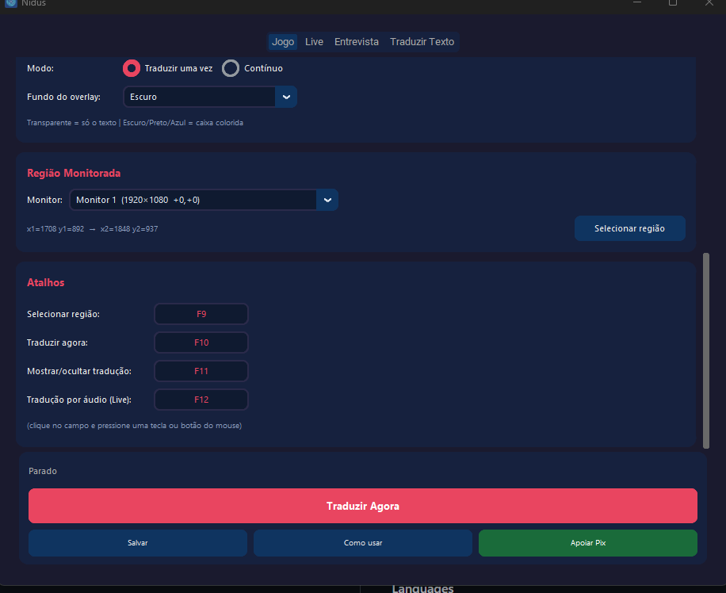
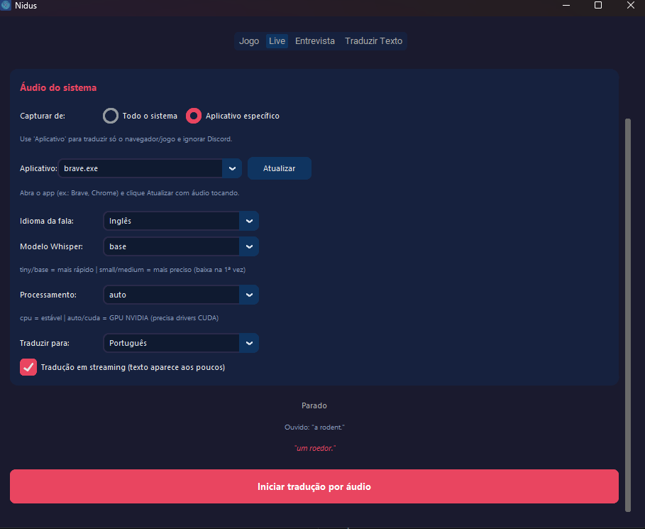
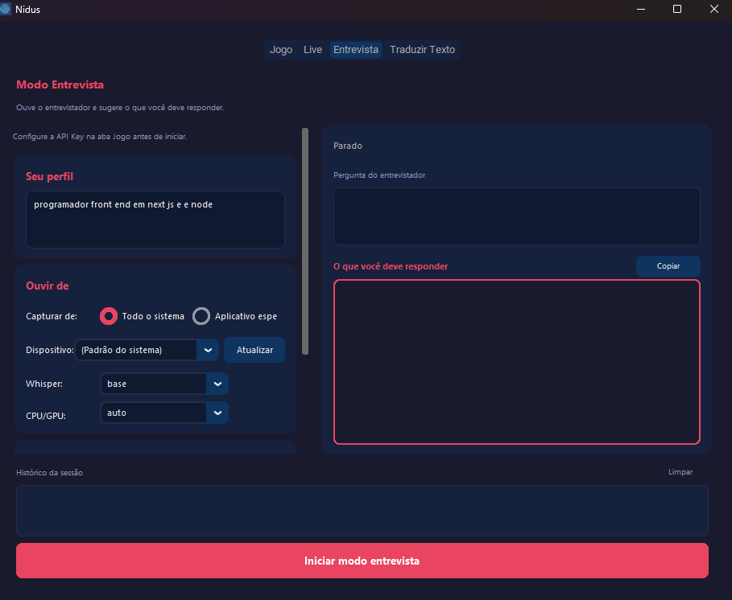
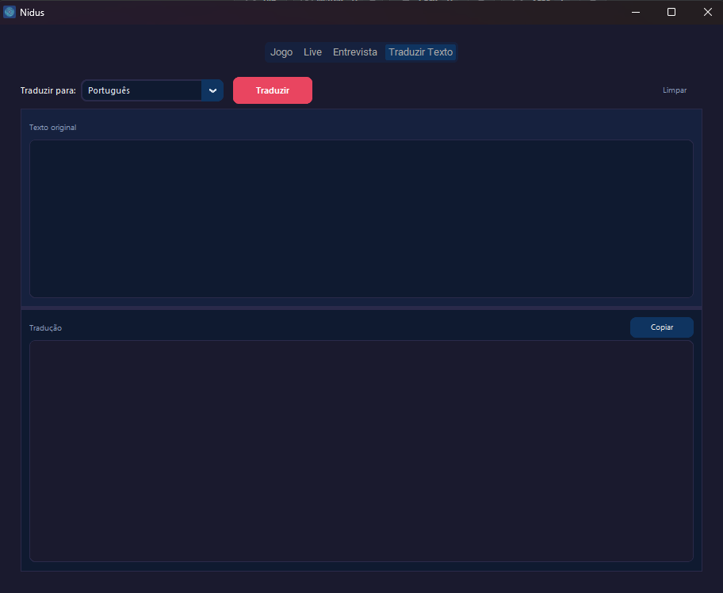
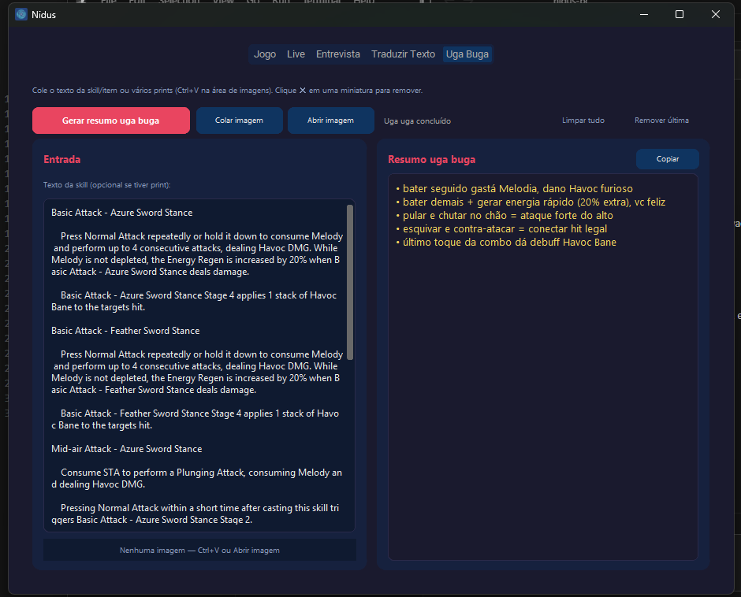

# Nidus

Nidus é um aplicativo de tradução para **PC (Windows e Linux)** que exibe um overlay flutuante sobre jogos e outros programas, capturando o texto da tela e traduzindo em tempo real com o provedor de IA da sua escolha. Também ofereceenda áudio (Live), entrevista, texto e arquivos de voz (WhatsApp).

   

---

## Capturas de tela

### Aba Jogo — tradução por tela

Configuração da API, região monitorada, atalhos, estilo do overlay e botões de ação:



### Aba Live — tradução por áudio

Captura de áudio do sistema ou de um app, Whisper e tradução em tempo real:



### Aba Entrevista — assistente para entrevistas

Ouve o entrevistador e sugere respostas com base no seu perfil:



### Aba Traduzir Texto

Tradutor manual para colar e traduzir qualquer texto:



### Aba Uga Buga — resumo de skills/itens

Cole o texto da skill/item (ou vários prints com **Ctrl+V**). A IA gera um resumo curto no estilo meme, em linguagem direta:



---

## ⚠️ Este aplicativo é 100% gratuito

Este aplicativo é totalmente gratuito. Nada aqui é pago e nunca será. Se alguém te vendeu o Nidus, você está sendo enganado — baixe sempre a partir do [repositório oficial](https://github.com/Ettym200/nidus-pc).

Se quiser, você pode apoiar o projeto voluntariamente (via Pix, dentro do app), mas isso é opcional.

---

## Download

**[Baixar última versão (Releases)](https://github.com/Ettym200/nidus-pc/releases/latest)**

| Sistema | Arquivo | Observação |
|---|---|---|
| **Windows** | `Nidus-windows.exe` (ou `Nidus.exe`) | Rode como administrador para atalhos em jogos |
| **Linux** | `Nidus-linux` | Live = áudio do **sistema** (PulseAudio/PipeWire). App específico ainda é só Windows |

### Windows (executável)

1. Baixe o `.exe` em [Releases](https://github.com/Ettym200/nidus-pc/releases/latest)
2. Execute e conceda permissão de administrador quando o Windows pedir
3. Configure sua API Key e comece a usar

### Linux (binário)

```bash
chmod +x Nidus-linux
./Nidus-linux
```

Dependências de sistema recomendadas (Debian/Ubuntu):

```bash
sudo apt install gir1.2-gtk-3.0 gir1.2-webkit2-4.1 pipewire-pulse
```

> **Não use `sudo ./Nidus-linux`** para o Live — o áudio do usuário (Pulse/PipeWire) some quando roda como root.

### Android / APK

A versão mobile (Flutter) está em outro repositório:

**[Repositório Android](https://github.com/Ettym200/Nidus)** · **[Baixar APK](https://github.com/Ettym200/Nidus/releases/latest)**

---

## Windows vs Linux

| Recurso | Windows | Linux |
|---|---|---|
| Tradução por tela (Jogo) | Sim | Sim |
| Overlay | Sim | Sim |
| Traduzir texto / Uga Buga | Sim | Sim |
| Transcrever áudio (mp3/ogg) | Sim | Sim |
| Live — todo o sistema | Sim (WASAPI) | Sim (Pulse/PipeWire) |
| Live — aplicativo específico | Sim | Ainda não |
| Entrevista | Sim | Sim (áudio do sistema) |
| Atalhos F9–F12 | Sim (`keyboard`, admin) | Sim (`pynput`) |

---

## Como usar

### 1. Instale

**Windows (executável — recomendado)**

Baixe o `.exe` em [Releases](https://github.com/Ettym200/nidus-pc/releases/latest) e execute.

**Windows (código-fonte)**

1. Instale o [Python 3.8+](https://www.python.org/downloads/) — marque **"Add Python to PATH"**
2. Clone ou baixe este repositório
3. Execute `scripts\instalar.bat`
4. Execute `scripts\iniciar.bat`

> O app pede administrador automaticamente — necessário para os atalhos funcionarem dentro do jogo.

**Linux (código-fonte)**

```bash
git clone https://github.com/Ettym200/nidus-pc
cd nidus-pc
bash scripts/instalar_linux.sh   # deps de sistema + pip
bash scripts/iniciar.sh          # abre o app
# ou com logs:
bash scripts/iniciar.sh --debug
```

Só com pip (se as libs GTK/WebKit já existirem):

```bash
pip install -r requirements.txt
python3 main.py
```

> No Wayland, captura de tela e atalhos globais podem ter limitações. Em caso de problema, teste em sessão X11.

### 2. Configure a API

Escolha um provedor e obtenha sua API Key:

| Provedor | Plano grátis | Link |
|---|---|---|
| OpenRouter | Sim | [openrouter.ai](https://openrouter.ai) |
| Groq | Sim | [console.groq.com](https://console.groq.com) |
| OpenAI | Pago | [platform.openai.com](https://platform.openai.com) |
| Anthropic | Pago | [console.anthropic.com](https://console.anthropic.com) |

Cole a chave no campo **API Key** do app (⚙).

### 3. Selecione a região

- Abra o jogo e deixe o texto/legenda aparecer na tela
- Clique em **Selecionar região** ou use o atalho (padrão: `F9`)
- Arraste para delimitar a área das legendas

### 4. Traduza

**Modo "Uma vez"** — atalho ou botão. Ideal para itens e missões.

**Modo "Contínuo"** — monitora a região e traduz quando o texto muda.

A tradução aparece num overlay flutuante. Você pode mover, redimensionar e ocultar.

### 5. Tradução por áudio (Live)

Na aba **Live**, o Nidus captura áudio, transcreve com Whisper e traduz (ou só transcreve se idioma ouvido = idioma de destino).

1. Configure a **API Key** se for traduzir entre idiomas diferentes
2. Escolha a fonte:
   - **Todo o sistema** — Windows e Linux
   - **Aplicativo específico** — só Windows
3. Defina **Idioma ouvido** (ex.: Português) e destino
4. **F12** para iniciar/parar

No Linux, toque qualquer áudio no sistema (navegador, player) e use **Todo o sistema**.

### 6. Modo Entrevista

Ouve o entrevistador e sugere respostas com base no seu perfil. No Linux use captura do sistema; no Windows também pode filtrar por app.

### 7. Transcrever áudio / Uga Buga / Texto

- **Transcrever áudio** — mp3/ogg do WhatsApp → texto (Whisper local)
- **Uga Buga** — resume skill/item a partir de texto ou prints
- **Traduzir texto** — cola e traduz

---

## Atalhos

| Padrão | Ação |
|---|---|
| `F9` | Selecionar região |
| `F10` | Traduzir agora / Iniciar-Parar |
| `F11` | Mostrar / ocultar overlay |
| `F12` | Live on/off |

No Windows, rode como administrador para os atalhos funcionarem com o jogo em foco.

---

## Funcionalidades

- Tradução por tela (região + IA) com overlay
- **Live** — áudio do sistema (Win/Linux) ou app (Win)
- **Entrevista** — perguntas → sugestões de resposta
- Transcrição de arquivo (WhatsApp ogg/mp3)
- Filtro anti-alucinação do Whisper
- Overlay configurável
- OpenRouter, Groq, OpenAI, Anthropic e APIs customizadas
- Atalhos globais
- Uga Buga + tradutor de texto

---

## Estrutura do projeto

```
nidus-pc/
├── main.py           # entrada do app
├── src/              # código Python
│   ├── audio_capture.py        # Windows (WASAPI)
│   ├── audio_capture_linux.py  # Linux (Pulse/PipeWire)
│   ├── hotkeys.py              # Win keyboard / Linux pynput
│   └── ui/web/                 # interface
├── assets/
├── scripts/          # instalar / iniciar / compilar (Win + Linux)
└── docs/
```

---

## Compilar

**Windows**

```
scripts\compilar.bat
```

Gera `dist\Nidus.exe`.

**Linux**

```bash
bash scripts/compilar_linux.sh
```

Gera `dist/Nidus-linux`.

Releases oficiais (tag `v*`) publicam os dois binários automaticamente via GitHub Actions.

---

## Apoie o projeto

Se o Nidus te ajudou, você pode contribuir voluntariamente via Pix dentro do app. Isso é totalmente opcional.

---

## Licença

MIT — use, modifique e distribua à vontade.
